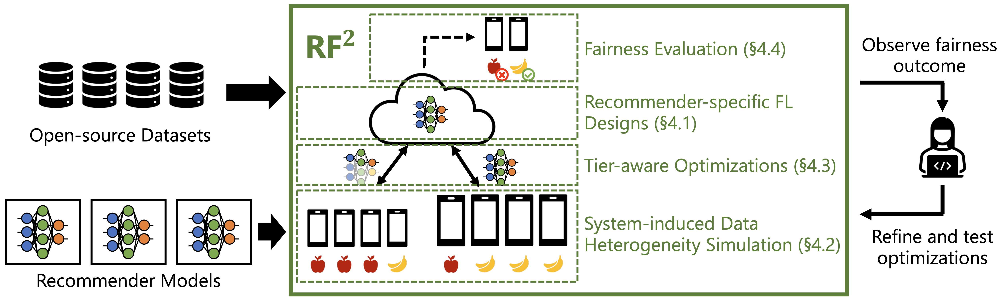

# RF^2: A Federated Recommendation Learning Simulator for System-induced Data Heterogeneity (RecSys ‘22)

RF^2 is a federated learning simulator for recommendation models, which enables fairness impact evaluation from commonly-used tier-aware FL optimizations in the presence of system-induced data heterogeneity.

Our work got accepted at RecSys ‘22!

Read our paper [preprint](https://arxiv.org/pdf/2206.02633.pdf)
 to learn more. The final camera-ready version will be available soon.



# Environment

This code was tested with Python v3.8.10, PyTorch v1.13.0.dev20220618+cu102, CUDA v10.2, and cuDNN v7.6.5.32-cuda.10.2.

# Example Executions

Below are some example execution configurations. See fl_libs/arg_parser.py for more configuration flags.

## FL + MovieLens-20 + Dirichlet w/ alpha=0.005

> python3.8 run.py --dataset movielens-20 --model dlrm --logarithm-input --att-weight-normalization --fl --learning-rate 1.0 --client-optimizer sgd --batch-size 0 --server-lr 1e-1 --test-freq 100 --ngpus 2 --clients-per-round 100 --tier-selection dirichlet-s1-0.005 --seed 123

## FL + Taobao + Dirichlet w/ alpha=0.005 + Exclude low-end devices

> python3.8 run.py --dataset taobao --model dlrm --logarithm-input --att-weight-normalization --fl --learning-rate 1.0 --client-optimizer sgd --batch-size 0 --server-lr 1e-2 --test-freq 1000 --ngpus 2 --clients-per-round 100 --tier-selection dirichlet-s9-0.005 --seed 123 --exclude-low

# Fairness Metric

To quantify fairness, we use the __relative accuracy change__ for each tier before and after applying an optimization. Mathematically, if model accuracy is $\beta^{t}_{p}$ for tier $t \in \{low, mid, high\}$ and an optimization $p$ ($p=0$ is no-optimization) is applied, the relative accuracy change for tier $t$ is defined as:

$$\frac{{\beta^{t}\_{p}} - \beta^{t}\_{0}}{\beta^{t}_{0}}$$

To quantify the fairness impact of an optimization $p$ across tiers, we report the __maximum difference in the accuracy change (**MDAC**)__ between tiers. MDAC is higher if optimization is more unfair, and 0 if perfectly fair. It is defined as:

$$MDAC = max(|\frac{\beta^{t_i}\_{p} - \beta^{t_i}\_{0}}{\beta^{t_i}\_{0}} - \frac{\beta^{t_j}\_{p} - \beta^{t_j}\_{0}}{\beta^{t_j}\_{0}}|),   t_i, t_j \in \\{low, mid, high\\}$$

# License

The majority of RF^2 is licensed under CC-BY-NC, however portions of the project are available under separate license terms: DeepCTR-Torch is licensed under the Apache 2.0 license; dlrm is licensed under the MIT license.

# Citation
If you want to cite our work, please use:

```
@inproceedings{maeng2022towards,
  author    = {Maeng, Kiwan and Lu, Haiyu and Melis, Luca and Nguyen, John and Rabbat, Mike and Wu, Carole-Jean},
  title     = {Towards Fair Federated Recommendation Learning: Characterizing the Inter-Dependence of System and Data Heterogeneity},
  booktitle = {RecSys '22: Sixteenth {ACM} Conference on Recommender Systems, Seattle,
               USA, 18 September 2022 - 23 September 2022},
  publisher = {{ACM}},
  year      = {2022},
  url       = {https://doi.org/10.1145/3523227.3546759},
  doi       = {10.1145/3523227.3546759}
}
```


